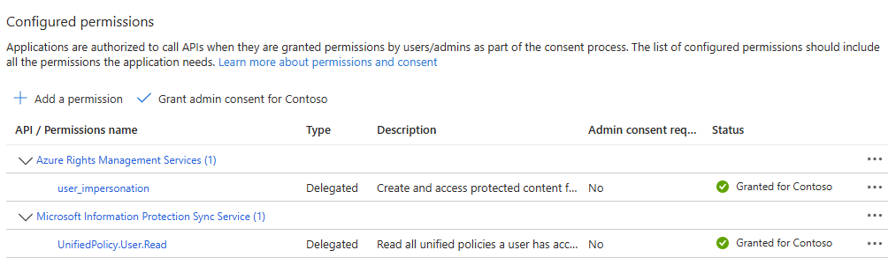

# InformationProtection

Welcome to the PowerShell module project dealing with Microsoft Information Protection (MIP).
For now, this module focuses on the _Client_ side - that is, directly interacting with labeled files and modifying their label state.

For managing the MIP Service itself, look into the [Purview API](https://learn.microsoft.com/en-us/rest/api/purview/)

> This module uses (and includes) the MIP SDK

## Installation

To install this module, run the following line in your PowerShell terminal:

```powershell
Install-Module InformationProtection -Scope CurrentUser
```

Or, alternatively, you could use the `PSFramework.NuGet` project to do the installation, if you have trouble making the above work:

```powershell
iwr https://raw.githubusercontent.com/PowershellFrameworkCollective/PSFramework.NuGet/refs/heads/master/bootstrap.ps1 | iex
Install-PSFModule InformationProtection
```

## Setup Authentication

After installing the module, we now need to configure authentication.
The MIP SDK accesses two resources - the "Azure Rights Management Services" and the "Microsoft Information Protection Sync Service".

> [How to set up an Application in Entra](https://github.com/FriedrichWeinmann/EntraAuth/blob/master/docs/overview.md)

For delegate authentication, each service only offers a single scope, which is needed:



The application scopes are not much more complex.

## Connect

There are two ways to perform the authentication:

+ Use previously established EntraAuth sessions
+ Create new sessions

### Previously established sessions

If you have already previously established a connection using "Connect-EntraService", you can reuse those.
By default, the services you need a connection to are "AzureRightsManagement" and "MIPSyncService" (which are registered when you import this module).
This option gives you the free choice about authentication methods used, covering all the scenarios supported by EntraAuth.

> Example 1: Delegate authentication using the browser

```powershell
Connect-EntraService -TenantID $tenantID -ClientID $clientID -Service AzureRightsManagement
Connect-EntraService -TenantID $tenantID -ClientID $clientID -Service MIPSyncService -UseRefreshToken
```

Example 2: Application authentication using a certificate

```powershell
Connect-EntraService -TenantID $tenantID -ClientID $clientID -Service AzureRightsManagement, MIPSyncService -Certificate $cert
```

### Create new sessions

You can establish new EntraAuth sessions as part of this command, by specifying the ClientID of the Entra Application to use:

```powershell
Connect-InformationProtection -ClientID $clientID
```

This will always only be an interactive session, authenticating using the local default browser.

## Profit

You are now good to go.
A few examples:

> List available labels

```powershell
Get-MipLabel
```

> Scan files for labeling status

```powershell
Get-ChildItem -Path . -Recurse -File | Get-MipFile
```

> Set Label for files

```powershell
Get-ChildItem -Path . -Recurse -File | Set-MipLabel -Label 'Highly Confidential\All Employees'
```
